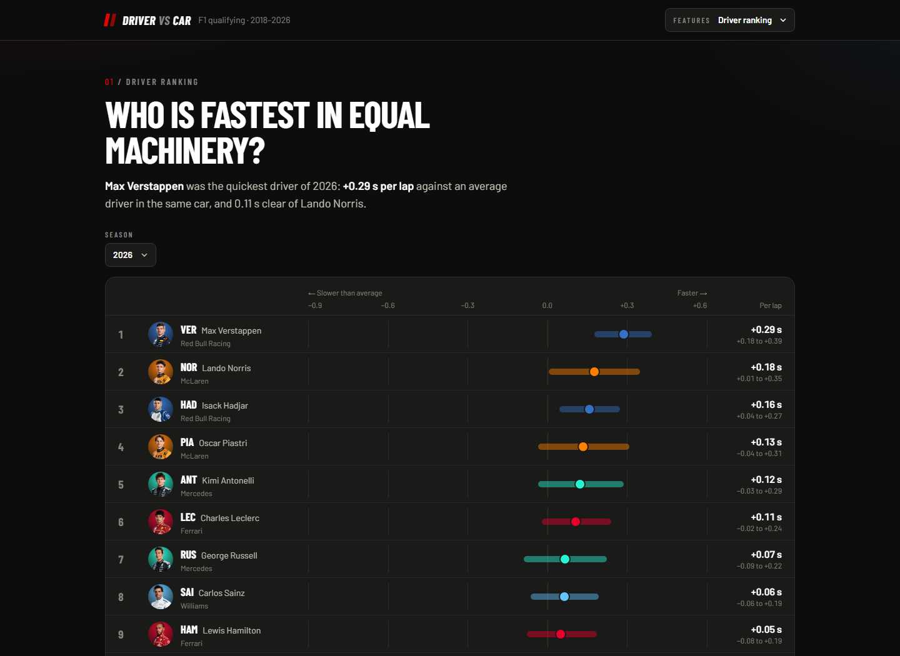
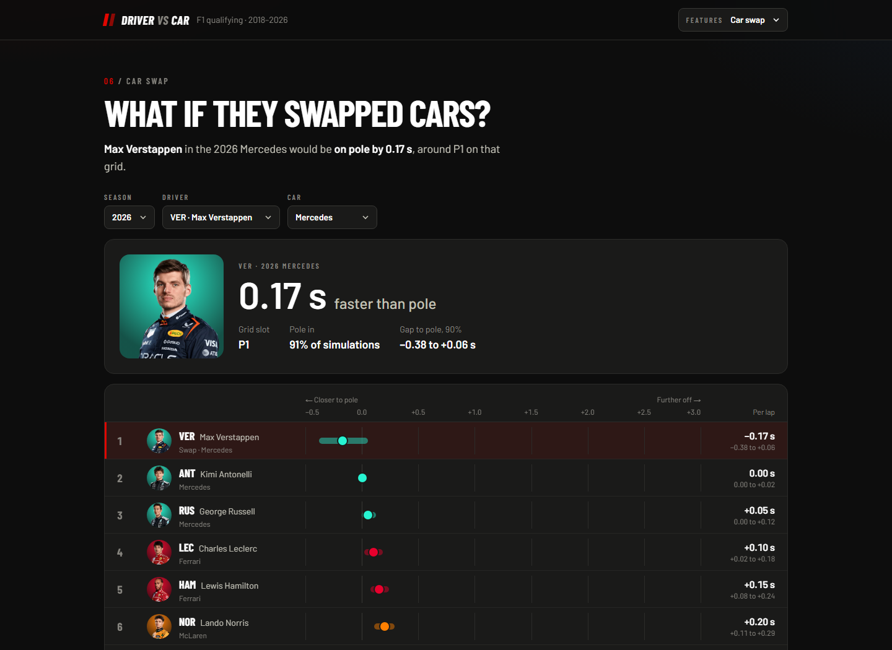
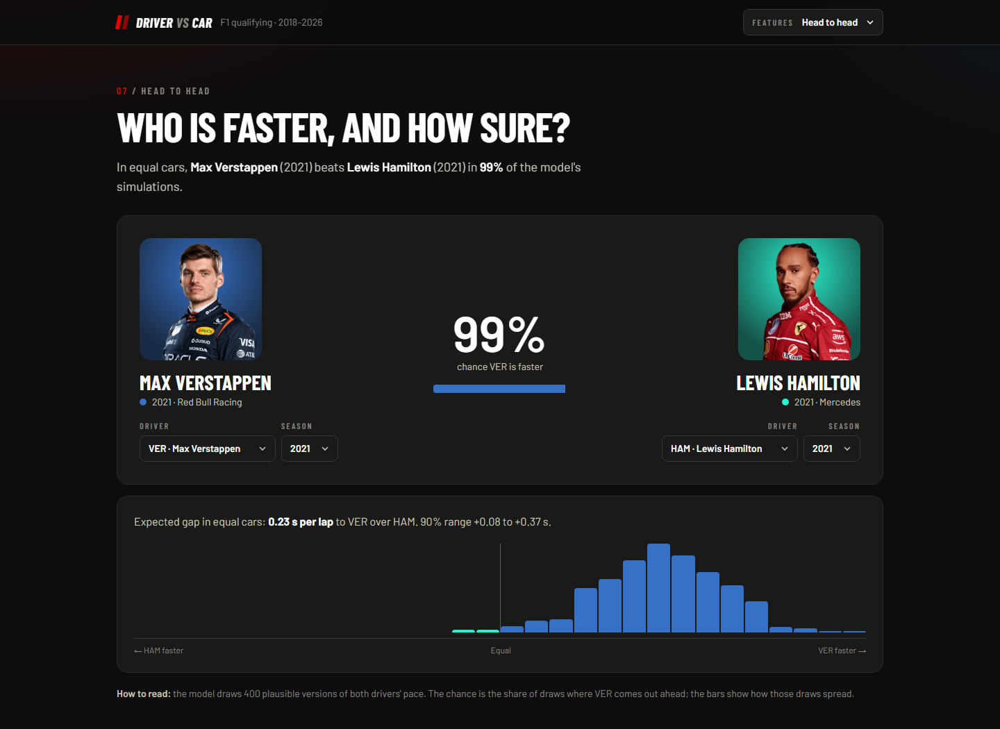

# Driver vs Car

How much of an F1 qualifying lap comes from the driver, and how much from the car? This project separates the two with a Bayesian model of every dry qualifying lap from 2018 to 2026, and shows the results in an interactive dashboard.

**Live dashboard: [f1-driver-vs-car.vercel.app](https://f1-driver-vs-car.vercel.app)**



## The problem

The car decides most of an F1 result, so "who is the best driver" is always tangled up with "who has the best car". Two natural experiments make it possible to pull them apart:

- **Teammates** drive the same car, so the gap between them is mostly driver.
- **Drivers who change teams** take the same skill into a different car, so their change in pace is mostly car.

One model that combines every teammate comparison and every team move gives a driver rating and a car rating for the whole grid, each with its uncertainty. The ratings measure **one-lap pace** in qualifying, not overall racecraft.

## How the model works

Each lap time is split into session conditions, car pace, driver pace, a shared team effect and noise:

$$
100 \ln(\text{lap time}) \sim \text{StudentT}\left(\nu,\ \alpha_{\text{session}} + \beta_{\text{driver, season}} + \gamma_{\text{team, season}} + \delta_{\text{team, session}},\ \sigma\right)
$$

- Effects are in percent of lap time. The dashboard converts them to seconds on a typical pole lap of each season.
- **Driver pace (β)** drifts slowly from season to season as a random walk, with a learned second-season step for rookies (+0.13% on average).
- **Car pace (γ)** starts fresh every season, since the 2022 and 2026 rule changes reset the field.
- **δ** captures what teammates share within one session, such as a car that suits the track.
- β and γ are centred at zero within each season. The Student-t likelihood keeps one bad lap from moving a rating.
- Fitted with PyMC and the nutpie sampler, 4 chains × 2,000 draws.

## Data

Qualifying from 2018 up to the latest 2026 round through [FastF1](https://github.com/theOehrly/Fast-F1): Q1, Q2 and Q3, plus sprint qualifying from 2023. That gives 8,488 laps after cleaning. Wet session parts, deleted laps, laps without a time and laps that were not a real attempt (slower than 102% of the driver's own best in the session, or 107% of the fastest lap) are removed and logged in `data/clean/dropped.csv`.

## What it finds

- **Max Verstappen** is the fastest driver in equal machinery in every season from 2018 to 2026.
- **The car decides 79% of the qualifying order in 2018–2021, 51% in 2022–2025 and 95% in 2026.** The closely matched ground-effect cars gave the drivers half the say, and the 2026 rules spread the field out again.
- **Team moves are explained by the car, not a sudden loss of form.** Examples are Bottas going from Mercedes to Alfa Romeo in 2022, and Albon going from Red Bull to Williams.

## Validation

All pass criteria were fixed before looking at the results. The headline test predicts the gap between teammates in sessions the model never saw, and compares it with a simple baseline: each driver's average gap to their teammate.

| Test | Result | Status |
| --- | --- | --- |
| Beat the baseline on held-out races (20% of each season, 5 random splits) | Model wins 5 of 5: MAE 0.309–0.326% vs 0.315–0.338% | Pass |
| Predict 2026 from data up to 2025 | 0.385% vs baseline 0.382% (guessing "all teammates equal": 0.372%) | Narrow fail |
| Simulated data looks like real data | 3 of 5 gap quantiles inside the simulated range (median 0.290% vs 0.277%) | Narrow fail |
| Sampler health (R-hat < 1.01, no divergences) | Full model: 0 divergences, R-hat 1.004. Refits: 8 of 12 healthy, worst R-hat 1.025 | Fails on refits |
| Robust to the priors (6 variants) | At least 4 of the top 5 drivers unchanged in every season | Pass |
| Known team moves | 4 of 6 explained as expected. PER and RIC are near ties | Narrow fail |

The model was refined once (adding the team-session effect and the second-season step), then frozen so it would not be tuned to the 2026 test. The full numbers are in `outputs/validation.json`.

## Limitations

- **One-lap pace only.** It says nothing about racecraft, tyre management or wet-weather skill.
- **Unequal treatment inside a team counts as driver skill.** Examples are getting an upgrade first or running a different setup.
- **A car's pace is a season average.** In-season development and track-specific strengths are blended together.
- **Some drivers are harder to separate from their car.** MAG and GRO only ever drove for Haas (2018–2020 here), so their split is less certain.
- **Forecasting a new season is no better than the baseline.** Most of the 2026 miss is at Red Bull, where Verstappen's margin over teammates shrank.
- **2026 is still running,** so its ratings will move as more rounds come in.

## Dashboard

The dashboard has seven views: driver ranking, car ranking, the driver network, career paths, car vs driver by era, a car-swap simulator and head-to-head odds. It is built with Next.js as a static export, with Recharts and react-force-graph, and reads the JSON files in `outputs/` at build time.

<p>
  
  
</p>

## Run it

Requires Python 3.12 and Node.js 20+. PyMC also needs a C++ compiler for PyTensor (MSYS2 g++ on Windows). The paths below are for Windows; use `.venv/bin/python` on macOS or Linux.

```bash
py -3.12 -m venv .venv
.venv/Scripts/python -m pip install -r requirements.txt

.venv/Scripts/python -m src.ingest     # download qualifying via FastF1 (about 3 h the first time, API rate limit)
.venv/Scripts/python -m src.clean      # cleaning rules + drop log
.venv/Scripts/python -m src.network    # driver network
.venv/Scripts/python -m src.baseline   # teammate-gap baseline
.venv/Scripts/python -m src.model      # full model, about 5 min (add "2020 2021" for a quick two-season run)
.venv/Scripts/python -m src.evaluate   # all validation tests, about 1 h
.venv/Scripts/python -m src.export     # dashboard data
.venv/Scripts/python -m pytest

npm --prefix web install
npm --prefix web run dev               # http://localhost:3000
```

## Layout

```
src/        pipeline: ingest, clean, network, baseline, model, evaluate, export
tests/      pytest
data/clean/ cleaned laps and the drop log (the FastF1 cache in data/raw/ is not tracked)
outputs/    ratings, validation results, dashboard data, figures
web/        Next.js dashboard
docs/       screenshots
```

## Credits

Timing data from FastF1. Driver photos © Formula 1, loaded from formula1.com and not stored in this repository. This is an unofficial fan project and is not associated with Formula 1.
